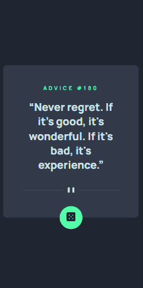
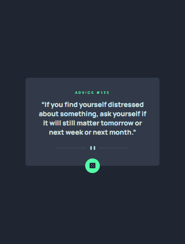
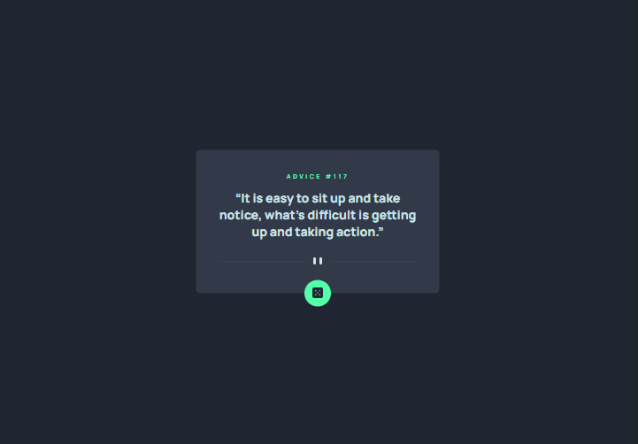

<h1 align="center"> Advice generator app</h1>

## Hello There! 👋
 This is a coding challenge from Frontend Mentor.

The challenge is to create this advice generator application using the [Advice Slip API](https://api.adviceslip.com) and give an advice to the user when clicking the button.

These are some of the challenge requirements:

- View the optimal layout for the app depending on their device's screen size
- See hover states for all interactive elements on the page
- Generate a new piece of advice by clicking the dice icon

## Devices View

Mobile(375px)
 

---

Tablet(768px) 
 

---

Laptop(1440px)
 

### [Test on your machine!](https://)

## Technologies and tools used

* HTML
* CSS
  * FLEXBOX
* JAVASCRIPT
   * API

